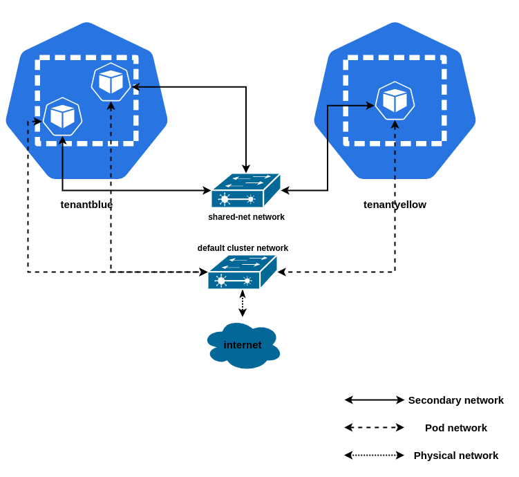
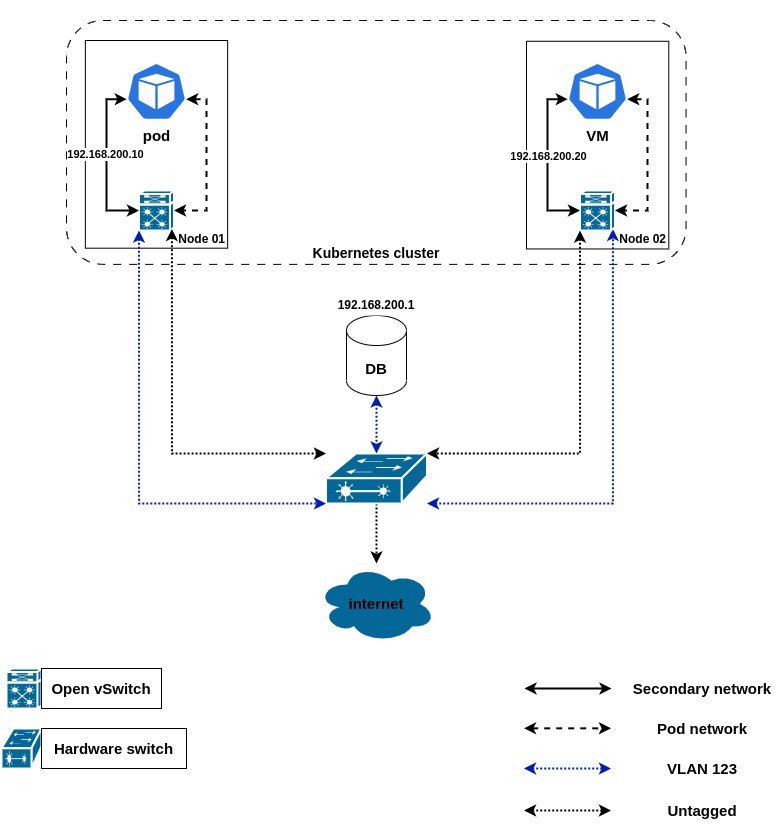
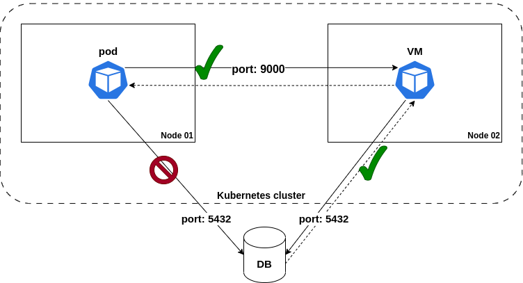

# fosdem2024-sdn
Demo scripts / config for the
[One SDN to connect them all](https://fosdem.org/2024/schedule/event/fosdem-2024-1708-one-sdn-to-connect-them-all)
talk at FOSDEM 2024.

## Requirements
- git
- jq
- kind
- [OVN-Kubernetes CNI](https://github.com/ovn-org/ovn-kubernetes/)
- [Multus-cni](https://github.com/k8snetworkplumbingwg/multus-cni)
- [kubernetes-nmstate](https://github.com/nmstate/kubernetes-nmstate/)
- [KubeVirt](https://github.com/kubevirt/kubevirt)

## Setup demo environment
Refer to the OVN-Kubernetes repo KIND documentation for more details; the gist
of it is you should clone the OVN-Kubernetes repository, and run their kind
helper script:

```bash
git clone git@github.com:ovn-org/ovn-kubernetes.git

cd ovn-kubernetes
pushd contrib ; ./kind.sh --multi-network-enable -ic; popd
```

This will get you a running kind cluster (one control plane, and two worker
nodes) in interconnect mode, configured to use OVN-Kubernetes as the default
cluster network, configuring the multi-homing OVN-Kubernetes feature gate, and
deploying `multus-cni` in the cluster.

We will now need to patch the worker nodes, and install `NetworkManager` in
them (both are requirements for nmstate, which `kubernetes-nmstate` depends on).
```bash
for node in "ovn-worker" "ovn-worker2"; do
    kubectl label node "$node" node-role.kubernetes.io/worker=""

    "$OCI_BIN" exec "$node" bash -c "apt-get update && apt-get install network-manager -y && service NetworkManager start"
done
```

Once these steps are done, we can proceed to install kubernetes-nmstate; please
run the following commands:
```bash
kubectl apply -f https://github.com/nmstate/kubernetes-nmstate/releases/download/v0.81.0/nmstate.io_nmstates.yaml
kubectl apply -f https://github.com/nmstate/kubernetes-nmstate/releases/download/v0.81.0/namespace.yaml
kubectl apply -f https://github.com/nmstate/kubernetes-nmstate/releases/download/v0.81.0/service_account.yaml
kubectl apply -f https://github.com/nmstate/kubernetes-nmstate/releases/download/v0.81.0/role.yaml
kubectl apply -f https://github.com/nmstate/kubernetes-nmstate/releases/download/v0.81.0/role_binding.yaml
kubectl apply -f https://github.com/nmstate/kubernetes-nmstate/releases/download/v0.81.0/operator.yaml

cat <<EOF | kubectl create -f -
apiVersion: nmstate.io/v1
kind: NMState
metadata:
  name: nmstate
EOF

kubectl rollout status -w -n nmstate deployment nmstate-webhook --timeout=2m
```

Finally we will install KubeVirt; for that run the following commands:
```bash
export VERSION=$(curl -s https://storage.googleapis.com/kubevirt-prow/release/kubevirt/kubevirt/stable.txt)
kubectl create -f "https://github.com/kubevirt/kubevirt/releases/download/${VERSION}/kubevirt-operator.yaml"
kubectl create -f "https://github.com/kubevirt/kubevirt/releases/download/${VERSION}/kubevirt-cr.yaml"

kubectl -n kubevirt wait kv kubevirt --timeout=360s --for condition=Available
kubevirt.kubevirt.io/kubevirt condition met
```

Now we have everything we need to proceed with the demo.

## Simple overlay scenario
This scenario is ilustrated by the following diagram:


We want to create pods in two separate namespaces, communicated over a secondary
overlay. Two of those pods (one in each namespace) will expose an HTTP
application on port 9000, while the pod named `podclient` will try to access
those applications over the secondary network overlay.

The first thing you need to do is to create the namespaces required for this
demo; execute the following command:
```bash
for ns_name in "tenantblue" "tenantyellow"; do
    kubectl create namespace "$ns_name"
done
```

Afterwards, provision the manifests for this scenario:
- [network configuration](manifests/overlay/01-netconfig.yaml)
- [workloads](manifests/overlay/02-workloads.yaml)

You should now assure the pods enter the `Running` status:
```bash
kubectl wait pod --all --for=condition=Ready --namespace=tenantblue
kubectl wait pod --all --for=condition=Ready --namespace=tenantyellow
```

Once the pods are running, we should inspect the server pods to learn their IP
addresses:
```bash
kubectl get pods -ntenantyellow yellow-server \
    -ojsonpath="{@.metadata.annotations.k8s\.v1\.cni\.cncf\.io\/network-status}" | jq
[
  {
    "name": "ovn-kubernetes",
    "interface": "eth0",
    "ips": [
      "10.244.2.8"
    ],
    "mac": "0a:58:0a:f4:02:08",
    "default": true,
    "dns": {}
  },
  {
    "name": "tenantyellow/shared-net",
    "interface": "net1",
    "ips": [
      "192.168.200.7"
    ],
    "mac": "0a:58:c0:a8:c8:07",
    "dns": {}
  }
]

kubectl get pods -ntenantblue blue-server \
    -ojsonpath="{@.metadata.annotations.k8s\.v1\.cni\.cncf\.io\/network-status}" | jq
[
  {
    "name": "ovn-kubernetes",
    "interface": "eth0",
    "ips": [
      "10.244.2.7"
    ],
    "mac": "0a:58:0a:f4:02:07",
    "default": true,
    "dns": {}
  },
  {
    "name": "tenantblue/shared-net",
    "interface": "net1",
    "ips": [
      "192.168.200.4"
    ],
    "mac": "0a:58:c0:a8:c8:04",
    "dns": {}
  }
]
```

Knowing the IP address assigned by the CNI plugin, we can now access the
web-servers from the client pod:
```bash
kubectl exec -ntenantblue podclient -- curl 192.168.200.4:9000/hostname
  % Total    % Received % Xferd  Average Speed   Time    Time     Time  Current
                                 Dload  Upload   Total   Spent    Left  Speed
100    11  100    11    0     0   9159      0 --:--:-- --:--:-- --:--:-- 11000
blue-server

kubectl exec -ntenantblue podclient -- curl 192.168.200.7:9000/hostname
  % Total    % Received % Xferd  Average Speed   Time    Time     Time  Current
                                 Dload  Upload   Total   Spent    Left  Speed
100    13  100    13    0     0  26915      0 --:--:-- --:--:-- --:--:-- 13000
yellow-server
```

## Simple overlay scenario - mixed workloads without IPAM
We assume you've cleaned up your namespaces from the previous execution; if you
didn't, please do so now (delete & recreate the namespaces is the fastest way).

Once that is done, provision the manifests for this scenario:
- [network configuration](manifests/overlay/01-netconfig-no-ipam.yaml)
- [workloads](manifests/overlay/02-mixed-workloads.yaml)

The difference in this scenario is two-fold:
1. the network does **not** provide IPAM - this means the user must use static
IPs when defining the workloads
2. the scenario consists of both VM and pod worklods in the same platform

But the overall idea is the same; we want to curl both servers from the client
(this time it is a VM); for that, we will use an helper binary, and log in via
console:

```bash
virtctl console vm-client -ntenantblue # the credentials are "fedora" / "fedora"
Successfully connected to vm-server console. The escape sequence is ^]
vm-server login: fedora
Password:
[fedora@vm-server ~]$ curl 192.168.200.20:9000/hostname
blue-server[fedora@vm-server ~]$ curl 192.168.200.30:9000/hostname
yellow-server[fedora@vm-server ~]$
```

## Localnet scenario - accessing the physical network
In this scenario, we will deploy workloads (both pods and VMs) requiring access
to a relational DB available on the physical network (i.e. deployed outside
Kubernetes).

For that we will deploy a secondary localnet network, connected to the physical
network. The traffic on this network will be isolated from the default cluster
network, since it will be encapsulated on a VLAN.

The diagram below depicts the scenario described above.


Achieving this scenario (... in a real production deployment ...) requires the
collaboration of two different roles:
- the cluster admin, who is responsible for allocating VLANs, assigning subnets,
and configuring the physical network
- the workload owner, who is responsible for creating the workloads. This user
contacts the administrator to know the subnet in which they should create the
workloads, and provisions the manifest defining them.

But first, let's create the required namespaces for this scenario:
```bash
for ns_name in "data-consumer" "data-adapter"; do
    kubectl create namespace "$ns_name"
done
```

### Admin persona workflow
The physical network must be properly configured and available for this demo.
Assuming a real life scenario, your network administrator would have to
provision a VLAN for your workloads to use; let's assume this person chose VLAN
123.

The `kind` cluster we are using implements networking between the nodes using a
bridge. Let's figure out its name:
```bash
podman network inspect kind --format '{{ .NetworkInterface }}'
podman1
```

Let's also assume this network admin persona chose a subnet for the workloads in
this physical network to use - e.g. 192.168.200.0/24. And the gateway will have
the `192.168.200.1/24` IP address assigned.

Thus, we will create a VLAN interface - with VLAN ID 123 - on top of the
`podman1` management interface of the bridge, set it with the `192.168.200.1/24`
IP address, and finally, enable it. You can find the respective commands below:
```bash
ip link add link podman1 name podman1.123 type vlan id 123
ip addr add 192.168.200.1/24 dev podman1.123
ip link set podman1.123 up
ip addr show podman1.123
14: podman1.123@podman1: <BROADCAST,MULTICAST,UP,LOWER_UP> mtu 1500 qdisc noqueue state UP group default qlen 1000
    link/ether 2a:ed:41:e8:86:d9 brd ff:ff:ff:ff:ff:ff
    inet 192.168.200.1/24 scope global podman1.123
       valid_lft forever preferred_lft forever
    inet6 fe80::28ed:41ff:fee8:86d9/64 scope link proto kernel_ll
       valid_lft forever preferred_lft forever
```

Once the physical network is configured, we can now create the network
attachment definition, and map our secondary network to the physical network
with kubernetes-nmstate's help. Provision the
[localnet network configuration](manifests/localnet/01-netconfig.yaml) file:
```bash
kubectl apply -f manifests/localnet/01-netconfig.yaml
```

We will now deploy the relational DB on the physical network where our workloads
will find their data.

#### Creating the database holding the data
To make this step simple, I've containerized a postgreSQL database with the
required configuration. Thus, you should just need to execute the following
command and it will expose the DB over port 5432.
```bash
podman run --name turtle-db --net=host -d quay.io/mduarted/turtle-db
```

**NOTE:** [this](https://github.com/maiqueb/rust-turtle-viewer/blob/main/images/postgres.Dockerfile)
is the image specification file that generated the `turtle-db` image

The credentials for accessing the DB are `splinter:cheese`; you can check the
connection to the DB (assuming you have `psql` installed) by running the
following command:
```bash
PGPASSWORD=cheese psql -U splinter -h 10.89.1.1 turtles -c "\dt"
Did not find any relations.
```

This just means the database schema was not yet loaded: it will be once we load
the application.

### Workload owner workflow
This user would have to contact the admin out of band, to know in which subnet
should he assign static IPs to the workloads - remember that in mixed workload
scenarios we cannot rely on IPAM (the VMs would not live-migrate). In our case,
anything on the `192.168.200.0/24` subnet is good.

With that in mind, we can just go ahead, and provision the
[workload manifest](manifests/localnet/02-mixed-workloads.yaml), which will
create a pod and a VM - the pod will expose a RESTful API on its secondary
network attachment, over port 9000. It is essentially a CRUD API. The VM on the
other hand, does ... nothing useful. We will just use it as a means to access
data both from the DB, and from the adapter pod exposing the DB's contents over
REST. Provision these workloads by executing the following command:
```bash
kubectl apply -f manifests/localnet/02-mixed-workloads.yaml
```

**NOTE:** [this](https://github.com/maiqueb/rust-turtle-viewer) is the repo
holding the code / image spec for the pod workload

### Accessing the database

Once both the workloads are running (the VM takes a while longer), we can access
the workloads - let's focus on the VM for now. The pod is pretty much just a
data adaptation layer.

We will access the VM via console, and we'll access the DB via the SQL client,
and also via the adapter, over its REST API.
```bash
virtctl console vm-workload -ndata-consumer # fedora:fedora
Successfully connected to vm-workload console. The escape sequence is ^]

vm-workload login: fedora
Password:

[fedora@vm-workload ~]$ PGPASSWORD=cheese psql -h 192.168.200.1 -Usplinter turtles -c "select * from ninja_turtles;"
 user_id |      name      |     email     |  weapon  |         created_on
---------+----------------+---------------+----------+----------------------------
       1 | leonardo       | leo@tmnt.org  | swords   | 2024-01-19 16:39:59.161604
       2 | donatello      | don@tmnt.org  | a stick  | 2024-01-19 16:39:59.161604
       3 | michaelangello | mike@tmnt.org | nunchuks | 2024-01-19 16:39:59.161604
       4 | raphael        | raph@tmnt.org | twin sai | 2024-01-19 16:39:59.161604
(4 rows)

[fedora@vm-workload ~]$ curl -H "Content-type: application/json" 192.168.200.10:9000/turtles | jq
  % Total    % Received % Xferd  Average Speed   Time    Time     Time  Current
                                 Dload  Upload   Total   Spent    Left  Speed
100   481  100   481    0     0  28986      0 --:--:-- --:--:-- --:--:-- 30062
{
  "Ok": [
    {
      "user_id": 1,
      "name": "leonardo",
      "email": "leo@tmnt.org",
      "weapon": "swords",
      "created_on": "2024-01-19T16:39:59.161604"
    },
    {
      "user_id": 2,
      "name": "donatello",
      "email": "don@tmnt.org",
      "weapon": "a stick",
      "created_on": "2024-01-19T16:39:59.161604"
    },
    {
      "user_id": 3,
      "name": "michaelangello",
      "email": "mike@tmnt.org",
      "weapon": "nunchuks",
      "created_on": "2024-01-19T16:39:59.161604"
    },
    {
      "user_id": 4,
      "name": "raphael",
      "email": "raph@tmnt.org",
      "weapon": "twin sai",
      "created_on": "2024-01-19T16:39:59.161604"
    }
  ]
}
```

### Multi network policies
Finally, we want to use network policies to specify specify how our workloads
are allowed to communicate with the various network entities deployed on the
physical network. While network policies are typically a Kubernetes construct
(thus usually available only for the cluster default network), the
OVN-Kubernetes plugin implements multi-network policies - and thus the users can
use the `MultiNetworkPolicy` custom resource to extend this behavior to
secondary networks.

For this demo, we want to ensure our VM workload can only access the DB data
that is exposed by the adapter pod. Thus, we want to ensure:
- the adapter pod can contact the DB over port 5432 (PostgreSQL default port)
- the adapter pod acceps incoming TCP connection from within the
192.168.200.0/24 subnet to port 9000
- the data consumer VM can only contact the adapter pod over in TCP port 9000

The following constraints are depicted in the following diagram:


Let's see what happens now when we try to access the DB from the VM workload:
```bash
virtctl console vm-workload -ndata-consumer        
Successfully connected to vm-workload console. The escape sequence is ^]
[fedora@vm-workload ~]$ PGPASSWORD=cheese PGCONNECT_TIMEOUT=5 psql -h 192.168.200.1 -Usplinter turtles -c "select * from ninja_turtles;"
psql: error: connection to server at "192.168.200.1", port 5432 failed: timeout expired
[fedora@vm-workload ~]$ curl -H "Content-type: application/json" 192.168.200.10:9000/turtles | jq
  % Total    % Received % Xferd  Average Speed   Time    Time     Time  Current
                                 Dload  Upload   Total   Spent    Left  Speed
100   481  100   481    0     0  26922      0 --:--:-- --:--:-- --:--:-- 28294
{
  "Ok": [
    {
      "user_id": 1,
      "name": "leonardo",
      "email": "leo@tmnt.org",
      "weapon": "swords",
      "created_on": "2024-01-22T09:52:26.685055"
    },
    {
      "user_id": 2,
      "name": "donatello",
      "email": "don@tmnt.org",
      "weapon": "a stick",
      "created_on": "2024-01-22T09:52:26.685055"
    },
    {
      "user_id": 3,
      "name": "michaelangello",
      "email": "mike@tmnt.org",
      "weapon": "nunchuks",
      "created_on": "2024-01-22T09:52:26.685055"
    },
    {
      "user_id": 4,
      "name": "raphael",
      "email": "raph@tmnt.org",
      "weapon": "twin sai",
      "created_on": "2024-01-22T09:52:26.685055"
    }
  ]
}
[fedora@vm-workload ~]$ 
```

As expected, it is now impossible to connect directly to the DB from the VM
workload; we need to access the data over the adapter pod.
